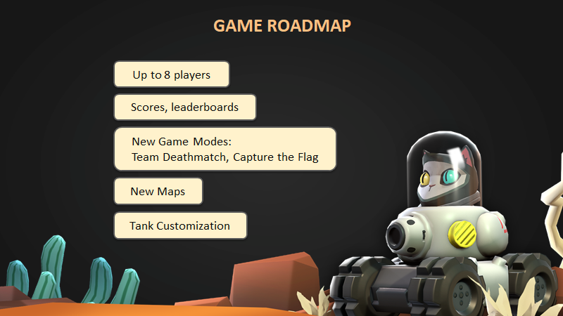

# space-cats

This is not a full Unity3D project, so it won't be possible to build. Code provided for reference.  
Client SDK part will be open-sourced separately.

## License
This project is licensed under the MIT License, see the [LICENSE](LICENSE) file for details.

## Presentation

  
Click to expand

  
  
  
  
  
  
  

